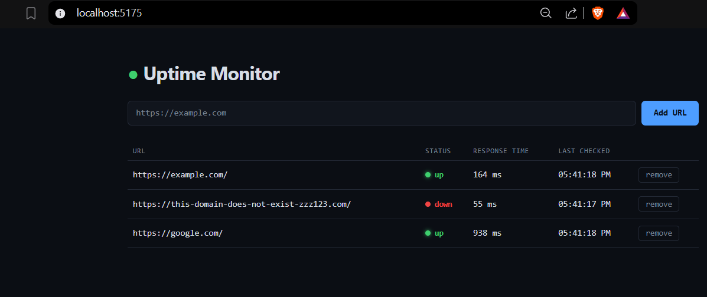

# Uptime Monitor

Full-stack MVP that registers URLs, pings each on an interval, and shows live up/down status + latency. Built for the Epifi/Tetriz.ai take-home assignment (spec: `ztask/task.md`).

- `/backend` — FastAPI + SQLite. Register URLs, background `asyncio` scheduler pings every `CHECK_INTERVAL_SECONDS` (default 30s), stores status code / response time / timestamp per check.
- `/frontend` — React (Vite). Polls the backend every 5s, shows a table of monitors with status, latency, last-checked time.
- `docker-compose.yml` — orchestrates both.
- `AI_LOG.md` / `prompts.md` — the AI collaboration record (raw prompts + course-corrections, and the cleaned-up phase-wise build recipe).
------------------------------------------------------------------------------------------------


------------------------------------------------------------------------------------------------

## 1-Line Setup

```
docker compose up --build
```

Backend on `http://localhost:8000`, frontend on `http://localhost:5173`.

## Testing Steps (verify up/down detection)

The database starts empty (or a fresh volume on the first `docker compose up`). Register a healthy URL and a broken one, then watch the dashboard.

**PowerShell users:** use `Invoke-RestMethod`, not `curl.exe` — Windows' native argument parsing mangles the embedded quotes in a raw curl JSON body no matter how you escape it (hit this repeatedly during the build — see `AI_LOG.md`). Run one command at a time, not pasted as a block.

```powershell
# healthy URL
Invoke-RestMethod -Uri "http://localhost:8000/monitors" -Method Post -ContentType "application/json" -Body (@{url="https://example.com"} | ConvertTo-Json)

# broken/unreachable URL
Invoke-RestMethod -Uri "http://localhost:8000/monitors" -Method Post -ContentType "application/json" -Body (@{url="https://this-domain-does-not-exist-zzz123.com"} | ConvertTo-Json)
```

**macOS/Linux users (real curl works fine):**
```bash
curl -X POST http://localhost:8000/monitors -H "Content-Type: application/json" -d '{"url":"https://example.com"}'
curl -X POST http://localhost:8000/monitors -H "Content-Type: application/json" -d '{"url":"https://this-domain-does-not-exist-zzz123.com"}'
```

Then either:
- Open `http://localhost:5173` — the table shows both rows as "pending", flipping to green "up" / red "down" within one check interval (~30s), no page refresh needed.
- Or poll the API directly:
  ```
  curl http://localhost:8000/monitors
  ```
  (or `Invoke-RestMethod -Uri "http://localhost:8000/monitors"` on Windows) — look for `is_up: true, status_code: 200` on the healthy one and `is_up: false, status_code: null` on the broken one.

## Deployment Sketch

For a real deployment, keep the same two-container shape but swap local-only pieces for managed equivalents:

- **Backend**: containerized FastAPI app deployed to **AWS ECS Fargate** (or Fly.io/Render for something lighter), behind an **Application Load Balancer**. Swap SQLite for **RDS Postgres** — the current schema (`monitors`, `checks`) maps directly, SQLite was purely an MVP simplicity choice.
- **Frontend**: static Vite build pushed to **S3 + CloudFront** (or Vercel/Netlify) instead of running the `serve` container — a static dashboard doesn't need a running Node process in production.
- **Scheduler**: at this scale a single background `asyncio` loop is fine; past a few hundred URLs it'd move to a dedicated worker (e.g. a scheduled ECS task or Lambda on an EventBridge cron) so ping load doesn't compete with API request handling.

Illustrative Terraform sketch (not production-hardened, just the shape):

```hcl
resource "aws_ecs_service" "backend" {
  name            = "uptime-monitor-backend"
  cluster         = aws_ecs_cluster.main.id
  task_definition = aws_ecs_task_definition.backend.arn
  desired_count   = 1
  launch_type     = "FARGATE"

  network_configuration {
    subnets          = var.private_subnet_ids
    security_groups  = [aws_security_group.backend.id]
    assign_public_ip = false
  }

  load_balancer {
    target_group_arn = aws_lb_target_group.backend.arn
    container_name   = "backend"
    container_port   = 8000
  }
}

resource "aws_db_instance" "postgres" {
  engine         = "postgres"
  instance_class = "db.t4g.micro"
  allocated_storage = 20
  db_name        = "uptime_monitor"
  # credentials, subnet group, etc. omitted for brevity
}

resource "aws_s3_bucket" "frontend" {
  bucket = "uptime-monitor-frontend"
}

resource "aws_cloudfront_distribution" "frontend" {
  origin {
    domain_name = aws_s3_bucket.frontend.bucket_regional_domain_name
    origin_id   = "frontend-s3"
  }
  # distribution config omitted for brevity
}
```

Not grading production hardening/security here per the spec — this is meant to show the topology, not a hardened setup (no WAF, no secrets management, no autoscaling policy shown, etc.).
